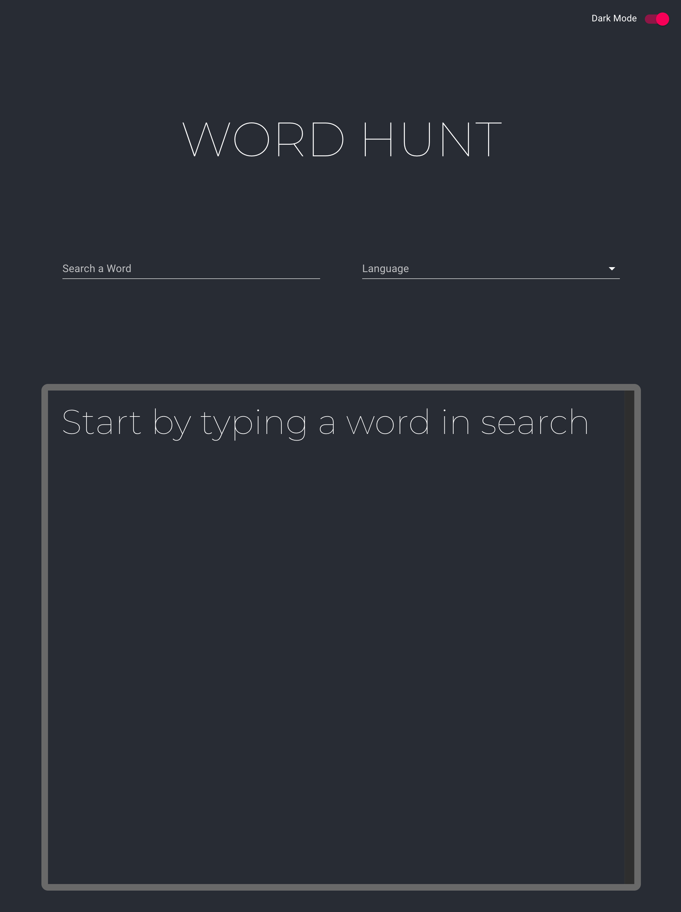

# wordhunt

A [re-frame](https://github.com/day8/re-frame) application designed to ... well, that part is up to
you.

## Getting Started

### Project Overview

This is a cljs re-frame translation of a [React
tutorial](https://www.youtube.com/watch?v=ToXna81iij0).



## Development

### Running the App

Start a temporary local web server, build the app with the `dev` profile, and serve the app,
browser test runner and karma test runner with hot reload:

```sh
npm install
npx shadow-cljs watch app
```

Please be patient; it may take over 20 seconds to see any output, and over 40 seconds to complete.

When `[:app] Build completed` appears in the output, browse to
[http://localhost:8280/](http://localhost:8280/).

[`shadow-cljs`](https://github.com/thheller/shadow-cljs) will automatically push ClojureScript code
changes to your browser on save. To prevent a few common issues, see
[Hot Reload in ClojureScript: Things to avoid](https://code.thheller.com/blog/shadow-cljs/2019/08/25/hot-reload-in-clojurescript.html#things-to-avoid).

Opening the app in your browser starts a
[ClojureScript browser REPL](https://clojurescript.org/reference/repl#using-the-browser-as-an-evaluation-environment),
to which you may now connect.

#### Connecting to the browser REPL from your editor

See
[Shadow CLJS User's Guide: Editor Integration](https://shadow-cljs.github.io/docs/UsersGuide.html#_editor_integration).
Note that `npm run watch` runs `npx shadow-cljs watch` for you, and that this project's running build ids is
`app`, `browser-test`, `karma-test`, or the keywords `:app`, `:browser-test`, `:karma-test` in a Clojure context.

Alternatively, search the web for info on connecting to a `shadow-cljs` ClojureScript browser REPL
from your editor and configuration.

For example, in Vim / Neovim with `fireplace.vim`
1. Open a `.cljs` file in the project to activate `fireplace.vim`
2. In normal mode, execute the `Piggieback` command with this project's running build id, `:app`:
    ```vim
    :Piggieback :app
    ```

#### Connecting to the browser REPL from a terminal

1. Connect to the `shadow-cljs` nREPL:
    ```sh
    lein repl :connect localhost:8777
    ```
    The REPL prompt, `shadow.user=>`, indicates that is a Clojure REPL, not ClojureScript.

2. In the REPL, switch the session to this project's running build id, `:app`:
    ```clj
    (shadow.cljs.devtools.api/nrepl-select :app)
    ```
    The REPL prompt changes to `cljs.user=>`, indicating that this is now a ClojureScript REPL.
3. See [`user.cljs`](dev/cljs/user.cljs) for symbols that are immediately accessible in the REPL
without needing to `require`.

### Running `shadow-cljs` Actions

See a list of [`shadow-cljs CLI`](https://shadow-cljs.github.io/docs/UsersGuide.html#_command_line)
actions:
```sh
npx shadow-cljs --help
```

Please be patient; it may take over 10 seconds to see any output. Also note that some actions shown
may not actually be supported, outputting "Unknown action." when run.

Run a shadow-cljs action on this project's build id (without the colon, just `app`):
```sh
npx shadow-cljs <action> app
```
### Debug Logging

The `debug?` variable in [`config.cljs`](src/cljs/wordhunt/config.cljs) defaults to `true` in
[`dev`](#running-the-app) builds, and `false` in [`prod`](#production) builds.

Use `debug?` for logging or other tasks that should run only on `dev` builds:

```clj
(ns wordhunt.example
  (:require [wordhunt.config :as config])

(when config/debug?
  (println "This message will appear in the browser console only on dev builds."))
```

## Production

Build the app with the `prod` profile:

```sh
npm install
npm run release
```

Please be patient; it may take over 15 seconds to see any output, and over 30 seconds to complete.

The `resources/public/js/compiled` directory is created, containing the compiled `app.js` and
`manifest.edn` files.
